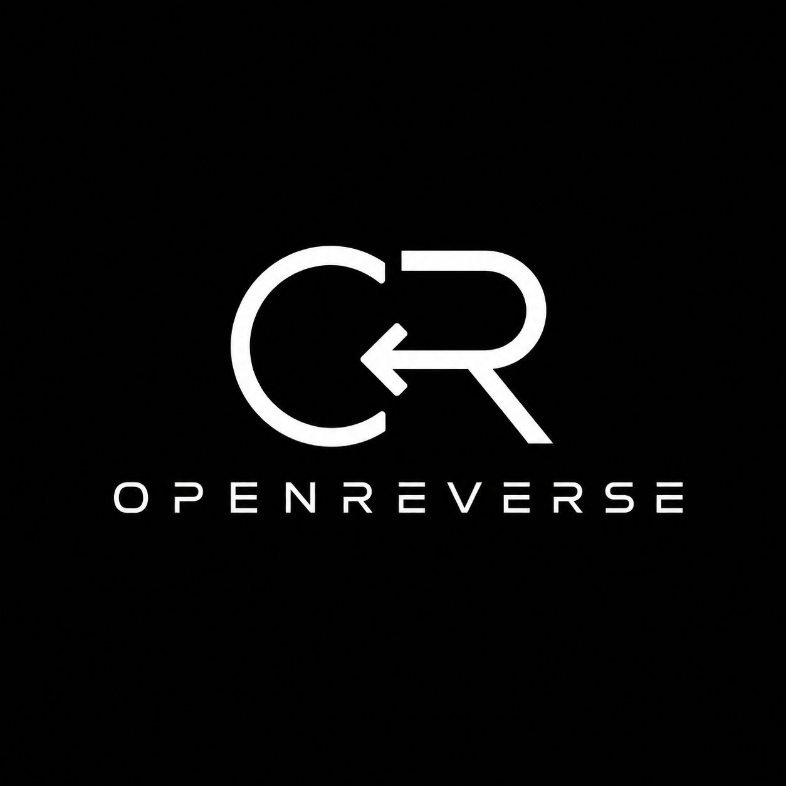
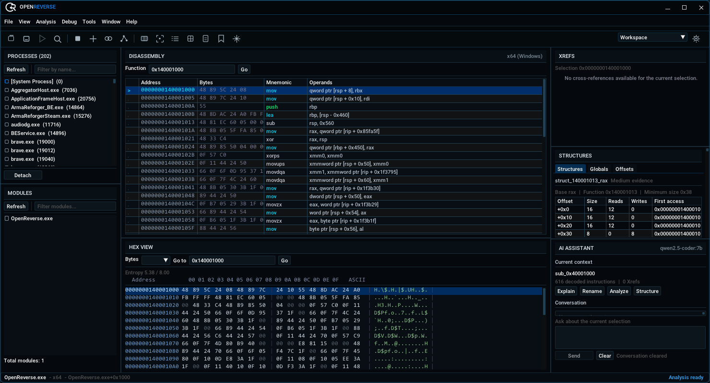

<p align="center">
  
</p>

# OpenReverse

Open-source reverse-engineering workspace for Windows.

[](https://github.com/apexfromparis/openreverse/actions/workflows/windows-ci.yml)
[](LICENSE)



OpenReverse combines offline PE and dump analysis with authorized, read-only
live-process inspection in a native C++17 desktop application. Its docked
workspace keeps disassembly, hex data, cross-references, offsets, structures,
modules, and optional AI context visible together.

## Features

### Available

- PE32/PE32+ parsing with distinct raw-file and RVA-mapped address spaces
- Static mapped-image, raw snapshot, and captured minidump-module import
- Read-only Windows process attachment, memory maps, and module inspection
- x86/x64 disassembly powered by Capstone
- x64 runtime-function (`.pdata`) boundaries, PE seeds, decoded-call discovery,
  and bounded recursive control-flow graphs with provenance
- Operand-level call, branch, read, write, and address cross-references
- ASCII and limited UTF-16 string scanning
- RIP-relative globals and conservative object-field evidence with simple
  Windows x64 argument/register-origin propagation
- Typed offsets, SHA-256 module identity, and JSON/C++ export
- Versioned `.orev` projects with atomic saves, verified target identity,
  annotations, bookmarks, structures, offsets, signatures, and workspace state
- AOB scanning and decoded-instruction signature generation with explicit
  wildcards and uniqueness status
- Hex view, data inspector, bookmarks, and indexed analysis navigation
- Interactive command shell and optional OpenAI-compatible AI client
- User API-key storage through Windows Credential Manager
- Optional native account foundation using Authorization Code + PKCE S256,
  loopback-only callbacks, and separate Windows account credential storage
- Versioned Windows x64 native extension API with bounded manifests, read-only
  analysis queries, controlled commands/navigation/panels, and extension-owned
  `.orev` state

### Experimental

- Review-first Version Intelligence workspace for old/new PE builds, with
  indexed multi-signal function matching, explicit ambiguity, deterministic
  change summaries, relationship-aware signature/global/offset/field migration,
  and persisted accept/reject decisions
- Heuristic function discovery fallbacks and inferred globals, fields, and
  structure candidates
- CFG block/edge presentation without a spatial graph layout
- AI explanations assembled from the current analysis selection
- Integrated script editor; script execution is not available

The assembly summary contains decoded instructions and CFG facts only; it does
not invent source variables or types. Experimental inference and migration
results are not authoritative and require review against the disassembly.

### Planned

Migration support for future project schema versions, a concrete symbol/PDB
provider, deeper interprocedural data-flow analysis, and broader old-target formats
are tracked in the
[roadmap](ROADMAP.md). Planned work is not included in the current build.

## Extensions / SDK

OpenReverse supports versioned native extensions through a public Windows x64 C
API. Extensions can read approved target/function snapshots, register controlled
commands and text panels, request navigation, and persist bounded state under
their own ID. They do not receive internal C++ or Dear ImGui objects.

The minimal example in `examples/hello_extension` builds against only the
header in `sdk/include`. Native extensions run in-process and must be trusted;
OpenReverse does not claim that they are sandboxed. See the
[extension SDK documentation](docs/EXTENSIONS.md) for the manifest, lifecycle,
build, installation, and compatibility contract.

## Installation

OpenReverse does not currently publish a GitHub release. Build it from source
using the commands below. Future installers will use the canonical name
`OpenReverse-x.y.z-Setup.exe`; release binaries belong in GitHub Releases, not
in this repository.

## Build from source

Requirements:

- Windows 10 or later
- Visual Studio 2022 with the **Desktop development with C++** workload
- CMake 3.23 or later
- Git, used by CMake to fetch pinned dependencies

```powershell
cmake --preset windows-x64
cmake --build --preset windows-x64-release --parallel
ctest --test-dir build/windows-x64 -C Release --output-on-failure
```

Outputs are written to `build/windows-x64/bin/Release/`:

- `OpenReverse.exe`
- `OpenReverse-2.0.0-Setup.exe`
- `OpenReverseCoreTests.exe`
- `OpenReverseAuthTests.exe`
- `OpenReverseTestFixture.exe`

See [Building](docs/BUILDING.md) for details.

## CLI

Launching without arguments starts the desktop workspace. Command-line entry
points use the same executable:

```powershell
build\windows-x64\bin\Release\OpenReverse.exe --help
build\windows-x64\bin\Release\OpenReverse.exe --version
build\windows-x64\bin\Release\OpenReverse.exe --cli
build\windows-x64\bin\Release\OpenReverse.exe open path\to\sample.exe
build\windows-x64\bin\Release\OpenReverse.exe dump path\to\mapped-module.bin
build\windows-x64\bin\Release\OpenReverse.exe dump path\to\snapshot.bin --base 0x140000000 --size 0x200000 --arch x64
```

`File > Open Dump` detects mapped PE images and minidumps. When critical raw
snapshot metadata cannot be detected, the desktop UI requires architecture,
image base, and module size instead of guessing. Dump files are never executed.

Because this is a Windows GUI-subsystem executable, automation should use
`Start-Process -Wait -PassThru` when it needs a reliable exit code.

## Architecture and AI privacy

The [architecture](docs/ARCHITECTURE.md) and
[analysis pipeline](docs/ANALYSIS_PIPELINE.md) documents describe target
ownership, scheduling, and analysis boundaries.

Account authentication is optional and never gates Community analysis. Its
native PKCE flow, loopback callback, secure storage, and current provider-
configuration blocker are documented in
[Desktop authentication](docs/AUTHENTICATION.md).

AI is optional. Selected context may include target names, disassembly,
strings, and generated summaries. Remote endpoints must use HTTPS; plaintext
HTTP is accepted only for exact loopback hosts. Review the provider's policy
before transmitting proprietary or sensitive data.

## Project information

- [Roadmap](ROADMAP.md)
- [Contributing](CONTRIBUTING.md)
- [Security policy](SECURITY.md)
- [Changelog](CHANGELOG.md)
- [Third-party notices](THIRD_PARTY_NOTICES.md)

Use OpenReverse only on binaries and processes you own or are explicitly
authorized to inspect.

## Community

Use [GitHub Issues](https://github.com/apexfromparis/openreverse/issues) for
reproducible bugs and focused feature requests. Development discussion is also
available in the [OpenReverse Discord community](https://discord.gg/4mmhKcy6US).

## License

OpenReverse is distributed under the [MIT License](LICENSE).
